# Production Order Creation - Sequence Diagram

## Tổng quan về Production Order Module

Production Order Module là một module quản lý lệnh sản xuất trong hệ thống VNG Glass, cho phép tạo các loại lệnh sản xuất khác nhau từ kế hoạch sản xuất, bao gồm: lệnh cắt kính, lệnh ghép kính, lệnh đổ keo và lệnh tạo gel.

### Cấu trúc Module:
- **Controllers**: 
  - `ProductionOrdersController.cs` - Quản lý chung lệnh sản xuất
  - `CutGlassOrderController.cs` - Lệnh cắt kính
  - `GlueGlassOrderController.cs` - Lệnh ghép kính
  - `PourGlueOrderController.cs` - Lệnh đổ keo
  - `CreateGelOrderController.cs` - Lệnh tạo gel
- **Services**: Các service tương ứng cho từng loại lệnh
- **DTOs**: Các Data Transfer Objects để truyền dữ liệu
- **Models**: `ProductionOrder.cs`, `ProductionOrderDetail.cs`, `ProductionOutput.cs`

## Sequence Diagram - Tạo Lệnh Sản Xuất

```plantuml
@startuml ProductionOrderCreation
!theme plain
skinparam backgroundColor #FFFFFF
skinparam sequenceArrowThickness 2
skinparam roundcorner 20
skinparam maxmessagesize 60

title **Production Order Creation Flow - VNG Glass System**

actor "User" as U
participant "Frontend\n(React/Next.js)" as FE
participant "CutGlassOrderController" as CGOC
participant "GlueGlassOrderController" as GGOC
participant "PourGlueOrderController" as PGOC
participant "CutGlassOrderService" as CGOS
participant "GlueGlassOrderService" as GGOS
participant "PourGlueOrderService" as PGOS
participant "SEP490DbContext" as DB
participant "ProductionPlan Table" as PPT
participant "ProductionOrder Table" as POT
participant "ProductionOrderDetail Table" as PODT
participant "ProductionOutput Table" as POUT
participant "Product Table" as PT
participant "ProductionPlanDetail Table" as PPDT

== **1. Khởi tạo Form Tạo Lệnh Sản Xuất** ==

U -> FE: Truy cập trang tạo lệnh sản xuất
FE -> FE: Load danh sách kế hoạch sản xuất
FE -> U: Hiển thị form với danh sách kế hoạch

== **2. Chọn Loại Lệnh Sản Xuất** ==

U -> FE: Chọn loại lệnh sản xuất
note right: Các loại lệnh:\n- Lệnh cắt kính\n- Lệnh ghép kính\n- Lệnh đổ keo\n- Lệnh tạo gel
FE -> U: Hiển thị form tương ứng

== **3. Chọn Kế Hoạch Sản Xuất** ==

U -> FE: Chọn kế hoạch sản xuất
FE -> FE: Load thông tin kế hoạch và sản phẩm
FE -> U: Hiển thị danh sách sản phẩm trong kế hoạch

== **4. Cấu Hình Sản Phẩm** ==

U -> FE: Nhập thông tin sản xuất cho từng sản phẩm
note right: ProductQuantities\n{\n  ProductionPlanDetailId: Quantity\n}\n\nFinishedProducts\n[\n  {\n    productName: string,\n    quantity: number\n  }\n]

FE -> FE: Validate thông tin sản xuất
FE -> U: Hiển thị sản phẩm đã cấu hình

== **5. Tạo Lệnh Cắt Kính** ==

alt Lệnh cắt kính
    U -> FE: Nhấn "Tạo lệnh cắt kính"
    FE -> FE: Validate form data
    FE -> CGOC: POST /api/CutGlassOrder/create
    note right: CutGlassOrderDto\n{\n  productionPlanId: number,\n  productQuantities: Dictionary<int, int>,\n  finishedProducts: FinishedProductDto[]\n}
    
    CGOC -> CGOS: CreateCutGlassOrderAsync(dto)
    
    == **5.1. Xử Lý Lệnh Cắt Kính** ==
    
    CGOS -> CGOS: BeginTransaction()
    
    CGOS -> CGOS: CreateProductionOrderAsync()
    note right: ProductionOrder\n{\n  OrderDate: DateTime.Now,\n  Type: "Cắt kính",\n  Description: "Lệnh cắt kính " + productNames,\n  ProductionPlanId: dto.ProductionPlanId\n}
    
    CGOS -> POT: Insert new ProductionOrder
    POT -> CGOS: Return ProductionOrder ID
    
    == **5.2. Xử Lý Sản Phẩm Hoàn Thành** ==
    
    loop For each finished product
        CGOS -> PT: Query Product WHERE ProductName=finishedProduct.ProductName
        PT -> CGOS: Return existing product or null
        
        alt Product không tồn tại
            CGOS -> CGOS: CreateNewProductAsync()
            note right: Extract dimensions from product name\n"Kính trắng KT: 700*400*5 mm"
            CGOS -> PT: Insert new Product
            PT -> CGOS: Return new Product ID
        end
        
        CGOS -> POUT: Insert ProductionOutput
        note right: ProductionOutput\n{\n  ProductId: productId,\n  ProductName: finishedProduct.ProductName,\n  Amount: finishedProduct.Quantity,\n  ProductionOrderId: orderId\n}
        POUT -> CGOS: Return ProductionOutput ID
    end
    
    == **5.3. Tạo Chi Tiết Lệnh Sản Xuất** ==
    
    loop For each product quantity
        CGOS -> PPDT: Query ProductionPlanDetail WHERE Id=planDetailId
        PPDT -> CGOS: Return plan detail
        
        CGOS -> PODT: Insert ProductionOrderDetail
        note right: ProductionOrderDetail\n{\n  ProductId: planDetail.ProductId,\n  Quantity: quantity,\n  productionOrderId: orderId\n}
        PODT -> CGOS: Return Detail ID
    end
    
    CGOS -> CGOS: CommitTransaction()
    CGOS -> CGOC: Return success
    CGOC -> FE: Return success message
    FE -> U: Hiển thị thông báo tạo thành công
end

== **6. Tạo Lệnh Ghép Kính** ==

alt Lệnh ghép kính
    U -> FE: Nhấn "Tạo lệnh ghép kính"
    FE -> FE: Validate form data
    FE -> GGOC: POST /api/GlueGlassOrder/create
    note right: GlueGlassOrderDto\n{\n  productionPlanId: number,\n  productQuantities: Dictionary<int, int>,\n  finishedProducts: FinishedProductDto[]\n}
    
    GGOC -> GGOS: CreateGlueGlassOrderAsync(dto)
    
    == **6.1. Xử Lý Lệnh Ghép Kính** ==
    
    GGOS -> GGOS: BeginTransaction()
    
    GGOS -> GGOS: CreateProductionOrderAsync()
    note right: ProductionOrder\n{\n  OrderDate: DateTime.Now,\n  Type: "Ghép kính",\n  Description: "Lệnh ghép kính " + productNames,\n  ProductionPlanId: dto.ProductionPlanId\n}
    
    GGOS -> POT: Insert new ProductionOrder
    POT -> GGOS: Return ProductionOrder ID
    
    == **6.2. Xử Lý Sản Phẩm Hoàn Thành** ==
    
    loop For each finished product
        GGOS -> PT: Query Product WHERE ProductName=finishedProduct.ProductName
        PT -> GGOS: Return existing product or null
        
        alt Product không tồn tại
            GGOS -> GGOS: CreateNewProductAsync()
            GGOS -> PT: Insert new Product
            PT -> GGOS: Return new Product ID
        end
        
        GGOS -> POUT: Insert ProductionOutput
        note right: ProductionOutput\n{\n  ProductId: productId,\n  ProductName: finishedProduct.ProductName,\n  Amount: finishedProduct.Quantity,\n  ProductionOrderId: orderId\n}
        POUT -> GGOS: Return ProductionOutput ID
    end
    
    == **6.3. Tạo Chi Tiết Lệnh Sản Xuất** ==
    
    loop For each product quantity
        GGOS -> PPDT: Query ProductionPlanDetail WHERE Id=planDetailId
        PPDT -> GGOS: Return plan detail
        
        GGOS -> PODT: Insert ProductionOrderDetail
        note right: ProductionOrderDetail\n{\n  ProductId: planDetail.ProductId,\n  Quantity: quantity,\n  productionOrderId: orderId\n}
        PODT -> GGOS: Return Detail ID
    end
    
    GGOS -> GGOS: CommitTransaction()
    GGOS -> GGOC: Return success
    GGOC -> FE: Return success message
    FE -> U: Hiển thị thông báo tạo thành công
end

== **7. Tạo Lệnh Đổ Keo** ==

alt Lệnh đổ keo
    U -> FE: Nhấn "Tạo lệnh đổ keo"
    FE -> FE: Validate form data
    FE -> PGOC: POST /api/PourGlueOrder/create
    note right: PourGlueOrderDto\n{\n  productionPlanId: number,\n  productQuantities: Dictionary<int, int>\n}
    
    PGOC -> PGOS: CreatePourGlueOrderAsync(dto)
    
    == **7.1. Xử Lý Lệnh Đổ Keo** ==
    
    PGOS -> PGOS: BeginTransaction()
    
    PGOS -> PGOS: CreateProductionOrderAsync()
    note right: ProductionOrder\n{\n  OrderDate: DateTime.Now,\n  Type: "Đổ keo",\n  Description: "Lệnh đổ keo",\n  ProductionPlanId: dto.ProductionPlanId\n}
    
    PGOS -> POT: Insert new ProductionOrder
    POT -> PGOS: Return ProductionOrder ID
    
    == **7.2. Tạo Chi Tiết Lệnh Sản Xuất** ==
    
    loop For each product quantity
        PGOS -> PPDT: Query ProductionPlanDetail WHERE Id=planDetailId
        PPDT -> PGOS: Return plan detail
        
        PGOS -> PODT: Insert ProductionOrderDetail
        note right: ProductionOrderDetail\n{\n  ProductId: planDetail.ProductId,\n  Quantity: quantity,\n  productionOrderId: orderId\n}
        PODT -> PGOS: Return Detail ID
    end
    
    PGOS -> PGOS: CommitTransaction()
    PGOS -> PGOC: Return success
    PGOC -> FE: Return success message
    FE -> U: Hiển thị thông báo tạo thành công
end

== **8. Chuyển Hướng** ==

FE -> FE: Redirect to production orders list
FE -> U: Hiển thị danh sách lệnh sản xuất

@enduml
```



## Chi Tiết Các Bước Trong Quy Trình

### 1. **Khởi tạo Form**
- Load danh sách kế hoạch sản xuất có sẵn
- Hiển thị form với các loại lệnh sản xuất
- Cho phép chọn kế hoạch và loại lệnh

### 2. **Chọn Loại Lệnh**
- **Lệnh cắt kính**: Cắt kính theo kích thước yêu cầu
- **Lệnh ghép kính**: Ghép các lớp kính với keo
- **Lệnh đổ keo**: Đổ keo vào khe giữa các lớp kính
- **Lệnh tạo gel**: Tạo gel keo cho sản xuất

### 3. **Cấu Hình Sản Phẩm**
- Chọn sản phẩm từ kế hoạch sản xuất
- Nhập số lượng sản xuất cho từng sản phẩm
- Định nghĩa sản phẩm hoàn thành (cho lệnh cắt và ghép)

### 4. **Tạo Lệnh Sản Xuất**
- Tạo ProductionOrder với thông tin cơ bản
- Tạo ProductionOrderDetail cho từng sản phẩm
- Tạo ProductionOutput cho sản phẩm hoàn thành
- Sử dụng transaction để đảm bảo tính toàn vẹn

### 5. **Xử Lý Sản Phẩm**
- Kiểm tra sản phẩm có tồn tại trong hệ thống
- Tạo sản phẩm mới nếu cần thiết
- Trích xuất thông tin kích thước từ tên sản phẩm

## Cấu Trúc Dữ Liệu

### ProductionOrder
```csharp
public class ProductionOrder
{
    public int Id { get; set; }
    public string? ProductionOrderCode { get; set; }
    public DateTime OrderDate { get; set; }
    public string? Description { get; set; }
    public string? Type { get; set; }
    public bool StatusDaNhapMisa { get; set; }
    public ProductionStatus? Status { get; set; }
    public string? ProductionPlanCode { get; set; }
    public int ProductionPlanId { get; set; }
    public ProductionPlan ProductionPlan { get; set; }
}
```

### ProductionOrderDetail
```csharp
public class ProductionOrderDetail
{
    public int Id { get; set; }
    public int ProductId { get; set; }
    public int Quantity { get; set; }
    public Product? Product { get; set; }
    public ProductionOrder? ProductionOrder { get; set; }
    public int productionOrderId { get; set; }
}
```

### ProductionOutput
```csharp
public class ProductionOutput
{
    public int Id { get; set; }
    public int ProductId { get; set; }
    public string? ProductName { get; set; }
    public UOM? UOM { get; set; }
    public decimal? Amount { get; set; }
    public int? Finished { get; set; } = 0;
    public int? Defected { get; set; } = 0;
    public int? ProductionOrderId { get; set; }
    public int? OutputFor { get; set; }
    public ProductionOrder ProductionOrder { get; set; }
    public Product Product { get; set; }
}
```

## API Endpoints

| Method | Endpoint | Description |
|--------|----------|-------------|
| GET | `/api/ProductionOrders/all` | Lấy danh sách tất cả lệnh sản xuất |
| GET | `/api/ProductionOrders/by-plan/{id}` | Lấy lệnh sản xuất theo kế hoạch |
| GET | `/api/ProductionOrders/{id}/outputs` | Lấy sản phẩm hoàn thành của lệnh |
| POST | `/api/CutGlassOrder/create` | Tạo lệnh cắt kính |
| POST | `/api/GlueGlassOrder/create` | Tạo lệnh ghép kính |
| POST | `/api/PourGlueOrder/create` | Tạo lệnh đổ keo |
| POST | `/api/CreateGelOrder/create` | Tạo lệnh tạo gel |

## Các Loại Lệnh Sản Xuất

### 1. **Lệnh Cắt Kính**
- Cắt kính theo kích thước yêu cầu
- Tạo sản phẩm hoàn thành với định dạng: "Kính trắng KT: 700*400*5 mm"
- Trích xuất thông tin kích thước từ tên sản phẩm

### 2. **Lệnh Ghép Kính**
- Ghép các lớp kính với keo
- Tạo sản phẩm hoàn thành
- Quản lý quy trình ghép kính

### 3. **Lệnh Đổ Keo**
- Đổ keo vào khe giữa các lớp kính
- Không tạo sản phẩm hoàn thành
- Chỉ quản lý quy trình đổ keo

### 4. **Lệnh Tạo Gel**
- Tạo gel keo cho sản xuất
- Quản lý công thức và nguyên liệu

## Tính Năng Đặc Biệt

### 1. **Quản Lý Sản Phẩm Tự Động**
- Tự động tạo sản phẩm mới nếu chưa tồn tại
- Trích xuất thông tin kích thước từ tên sản phẩm
- Quản lý sản phẩm hoàn thành và bán thành phẩm

### 2. **Transaction Management**
- Sử dụng database transaction
- Đảm bảo tính toàn vẹn dữ liệu
- Rollback nếu có lỗi xảy ra

### 3. **Quản Lý Trạng Thái**
- Theo dõi trạng thái lệnh sản xuất
- Quản lý sản phẩm hoàn thành và lỗi
- Báo cáo tiến độ sản xuất

### 4. **Liên Kết với Kế Hoạch**
- Tạo lệnh từ kế hoạch sản xuất
- Kế thừa thông tin sản phẩm
- Theo dõi tiến độ theo kế hoạch

## Xử Lý Lỗi

- **Validation**: Kiểm tra dữ liệu đầu vào
- **Transaction**: Đảm bảo tính toàn vẹn dữ liệu
- **Exception Handling**: Xử lý lỗi và rollback
- **Logging**: Ghi log các hoạt động quan trọng

## Bảo Mật

- **Authentication**: Yêu cầu đăng nhập
- **Authorization**: Kiểm tra quyền truy cập (MANAGER, PRODUCTION, ACCOUNTANT)
- **Input Validation**: Validate dữ liệu đầu vào
- **SQL Injection Protection**: Sử dụng Entity Framework
