# Production Plan Creation - Sequence Diagram

## Tổng quan về Production Plan Module

Production Plan Module là một module quản lý kế hoạch sản xuất trong hệ thống VNG Glass, cho phép tạo kế hoạch sản xuất từ đơn hàng bán hàng, tính toán vật tư cần thiết và quản lý quy trình sản xuất.

### Cấu trúc Module:
- **Controller**: `ProductionPlanController.cs` - Xử lý các HTTP requests
- **Service**: `ProductionPlanService.cs` - Logic nghiệp vụ
- **DTOs**: Các Data Transfer Objects để truyền dữ liệu
- **Models**: `ProductionPlan.cs`, `ProductionPlanDetail.cs` - Entity models

## Sequence Diagram - Tạo Kế Hoạch Sản Xuất

```plantuml
@startuml ProductionPlanCreation
!theme plain
skinparam backgroundColor #FFFFFF
skinparam sequenceArrowThickness 2
skinparam roundcorner 20
skinparam maxmessagesize 60

title **Production Plan Creation Flow - VNG Glass System**

actor "User" as U
participant "Frontend\n(React/Next.js)" as FE
participant "ProductionPlanController" as PPC
participant "ProductionPlanService" as PPS
participant "SEP490DbContext" as DB
participant "SaleOrder Table" as SOT
participant "ProductionPlan Table" as PPT
participant "ProductionPlanDetail Table" as PPDT
participant "Product Table" as PT
participant "GlassStructure Table" as GST
participant "Customer Table" as CT

== **1. Khởi tạo Form Tạo Kế Hoạch** ==

U -> FE: Truy cập trang tạo kế hoạch sản xuất
FE -> FE: Load danh sách đơn hàng bán hàng
FE -> U: Hiển thị form với danh sách đơn hàng

== **2. Chọn Đơn Hàng Bán Hàng** ==

U -> FE: Chọn đơn hàng bán hàng
FE -> FE: Load thông tin đơn hàng và sản phẩm
FE -> U: Hiển thị danh sách sản phẩm trong đơn hàng

== **3. Cấu Hình Sản Phẩm Sản Xuất** ==

U -> FE: Nhập thông tin sản xuất cho từng sản phẩm
note right: ProductionPlanProductInputDTO\n{\n  productId: number,\n  quantity: number,\n  thickness: number,\n  glueLayers: number,\n  glassLayers: number,\n  glass4mm: number,\n  glass5mm: number,\n  butylType: number,\n  isCuongLuc: boolean\n}

FE -> FE: Validate thông tin sản xuất
FE -> U: Hiển thị sản phẩm đã cấu hình

== **4. Tạo Kế Hoạch Sản Xuất** ==

U -> FE: Nhấn "Tạo kế hoạch sản xuất"
FE -> FE: Validate form data
FE -> PPC: POST /api/ProductionPlan/create-from-sale-order
note right: CreateProductionPlanFromSaleOrderDTO\n{\n  saleOrderId: number,\n  products: ProductionPlanProductInputDTO[]\n}

PPC -> PPS: CreateProductionPlanFromSaleOrderAsync(dto)

== **5. Xử Lý Tạo Kế Hoạch** ==

PPS -> SOT: Query SaleOrder WHERE Id=dto.SaleOrderId
note right: Include Customer, OrderDetails, OrderDetailProducts, Product, GlassStructure
SOT -> PPS: Return SaleOrder with related data

alt SaleOrder không tồn tại
    PPS -> PPC: Throw exception "Sale order not found"
    PPC -> FE: Return error message
    FE -> U: Hiển thị lỗi
else SaleOrder tồn tại
    PPS -> PPT: Insert new ProductionPlan
    note right: ProductionPlan\n{\n  SaleOrderId: saleOrder.Id,\n  Customer: saleOrder.Customer,\n  PlanDate: DateTime.Now,\n  Status: "Đang sản xuất"\n}
    PPT -> PPS: Return ProductionPlan ID
end

== **6. Tính Toán Vật Tư và Tạo Chi Tiết** ==

PPS -> PPS: Initialize totalKeoNano = 0, totalKeoMem = 0

loop For each product in dto.Products
    PPS -> PT: Query Product WHERE Id=prod.ProductId
    note right: Include GlassStructure
    PT -> PPS: Return Product with GlassStructure
    
    PPS -> PPS: Calculate glass layers
    note right: glass5mm = 2\nglass4mm = GlassStructure.GlassLayers - 2\nbutylType = GlassStructure.AdhesiveThickness
    
    PPS -> PPS: Parse width and height from string to decimal
    
    PPS -> PPS: Calculate adhesive requirements
    note right: areaKeo = ((width - 20) * (height - 20)) / 1,000,000\ndoDayKeo = thickness - (glass4mm * 4) - (glass5mm * 5)\ntongKeo = areaKeo * doDayKeo * 1.2
    
    PPS -> PPS: Calculate butyl length
    note right: doDaiButyl = ((width + height) * 2 * glueLayers) / 1000
    
    PPS -> PPS: Update total adhesive quantities
    alt AdhesiveType == "nano"
        PPS -> PPS: totalKeoNano += tongKeo
    else AdhesiveType == "mềm"
        PPS -> PPS: totalKeoMem += tongKeo
    end
    
    PPS -> PPDT: Insert ProductionPlanDetail
    note right: ProductionPlanDetail\n{\n  ProductionPlanId: plan.Id,\n  ProductId: product.Id,\n  Quantity: prod.Quantity,\n  Doday: prod.Thickness,\n  SoLopKeo: prod.GlueLayers,\n  SoLopKinh: prod.GlassLayers,\n  UOM: UOM.Tấm,\n  Kinh4: glass4mm,\n  Kinh5: glass5mm,\n  LoaiButyl: butylType,\n  IsKinhCuongLuc: prod.IsCuongLuc ? 1 : 0,\n  TongKeoNano: (AdhesiveType == "nano") ? tongKeo * quantity : 0,\n  TongKeoMem: (AdhesiveType == "mềm") ? tongKeo * quantity : 0,\n  DoDaiButyl: doDaiButyl\n}
    PPDT -> PPS: Return ProductionPlanDetail ID
end

PPS -> DB: SaveChanges()
DB -> PPS: Confirm transaction

== **7. Trả Về Kết Quả** ==

PPS -> PPS: Create ProductionPlanDetailViewDTO
note right: ProductionPlanDetailViewDTO\n{\n  CustomerName: saleOrder.Customer.CustomerName,\n  Address: saleOrder.Customer.Address,\n  Phone: saleOrder.Customer.Phone,\n  OrderCode: saleOrder.OrderCode,\n  OrderDate: saleOrder.OrderDate,\n  PlanDate: plan.PlanDate,\n  Status: plan.Status,\n  Done: 0\n}

PPS -> PPC: Return ProductionPlanDetailViewDTO
PC -> FE: Return production plan detail
FE -> U: Hiển thị thông báo tạo thành công

== **8. Chuyển Hướng** ==

FE -> FE: Redirect to production plan detail page
FE -> U: Hiển thị chi tiết kế hoạch sản xuất

== **9. Xem Chi Tiết Vật Tư (Tùy chọn)** ==

U -> FE: Nhấn "Xem chi tiết vật tư"
FE -> PPC: GET /api/ProductionPlan/detail/{id}/materials
PPC -> PPS: GetProductionPlanMaterialDetailAsync(id)

PPS -> PPDT: Query ProductionPlanDetails WHERE ProductionPlanId=id
note right: Include Product, GlassStructure
PPDT -> PPS: Return plan details

PPS -> PPS: Calculate material totals
note right: TotalKeoNano = Sum(TongKeoNano)\nTotalKeoMem = Sum(TongKeoMem)\nChatA = 10, KOH = 2, H2O = 8\nNuocLieu = 10, A = 7, B = 3

PPS -> PPS: Create ProductionPlanMaterialDetailDTO
PPS -> PPC: Return material details
PC -> FE: Return material details
FE -> U: Hiển thị chi tiết vật tư cần thiết

@enduml
```



## Chi Tiết Các Bước Trong Quy Trình

### 1. **Khởi tạo Form**
- Load danh sách đơn hàng bán hàng có sẵn
- Hiển thị form với các trường cấu hình sản xuất
- Cho phép chọn đơn hàng và sản phẩm

### 2. **Chọn Đơn Hàng**
- Hiển thị danh sách đơn hàng bán hàng
- Load thông tin chi tiết đơn hàng và sản phẩm
- Hiển thị danh sách sản phẩm cần sản xuất

### 3. **Cấu Hình Sản Xuất**
- Nhập thông tin sản xuất cho từng sản phẩm
- Cấu hình độ dày, số lớp keo, số lớp kính
- Xác định loại kính (4mm, 5mm) và butyl
- Chọn kính cường lực hay không

### 4. **Tính Toán Vật Tư**
- Tính toán diện tích keo dựa trên kích thước sản phẩm
- Xác định số lượng kính 4mm và 5mm cần thiết
- Tính toán lượng keo nano và keo mềm
- Tính độ dài butyl cần thiết

### 5. **Tạo Kế Hoạch**
- Tạo ProductionPlan với thông tin cơ bản
- Tạo ProductionPlanDetail cho từng sản phẩm
- Lưu trữ các thông số tính toán
- Cập nhật trạng thái kế hoạch

## Cấu Trúc Dữ Liệu

### ProductionPlan
```csharp
public class ProductionPlan
{
    public int Id { get; set; }
    public DateTime PlanDate { get; set; }
    public int? SaleOrderId { get; set; }
    public string? Status { get; set; }
    public SaleOrder? SaleOrder { get; set; }
    public Customer? Customer { get; set; }
    public ICollection<ProductionPlanDetail> ProductionPlanDetails { get; set; }
}
```

### ProductionPlanDetail
```csharp
public class ProductionPlanDetail
{
    public int Id { get; set; }
    public int ProductionPlanId { get; set; }
    public int ProductId { get; set; }
    public int Quantity { get; set; }
    public int Done { get; set; } = 0;
    public UOM? UOM { get; set; }
    public int? Doday { get; set; }
    public int? SoLopKeo { get; set; }
    public int? SoLopKinh { get; set; }
    public int? Kinh4 { get; set; } = 0;
    public int? Kinh5 { get; set; } = 0;
    public int? IsKinhCuongLuc { get; set; } = 0;
    public int? LoaiButyl { get; set; } = 0;
    public decimal? TongKeoNano { get; set; } = 0;
    public decimal? TongKeoMem { get; set; } = 0;
    public decimal? DoDaiButyl { get; set; } = 0;
    public int? DaGiao { get; set; } = 0;
    public Product? Product { get; set; }
    public ProductionPlan? ProductionPlan { get; set; }
}
```

## API Endpoints

| Method | Endpoint | Description |
|--------|----------|-------------|
| GET | `/api/ProductionPlan/list` | Lấy danh sách kế hoạch sản xuất |
| GET | `/api/ProductionPlan/detail/{id}` | Lấy chi tiết kế hoạch sản xuất |
| GET | `/api/ProductionPlan/detail/{id}/products` | Lấy chi tiết sản phẩm trong kế hoạch |
| GET | `/api/ProductionPlan/detail/{id}/materials` | Lấy chi tiết vật tư cần thiết |
| GET | `/api/ProductionPlan/detail/{id}/production-orders` | Lấy danh sách lệnh sản xuất |
| POST | `/api/ProductionPlan/create-from-sale-order` | Tạo kế hoạch từ đơn hàng bán |
| DELETE | `/api/ProductionPlan/{id}` | Xóa kế hoạch sản xuất |

## Tính Năng Đặc Biệt

### 1. **Tính Toán Vật Tư Tự Động**
- Tính diện tích keo: `((width - 20) × (height - 20)) / 1,000,000`
- Tính độ dày keo: `thickness - (glass4mm × 4) - (glass5mm × 5)`
- Tính tổng keo: `areaKeo × doDayKeo × 1.2`
- Tính độ dài butyl: `((width + height) × 2 × glueLayers) / 1000`

### 2. **Quản Lý Loại Keo**
- Phân biệt keo nano và keo mềm
- Tính toán riêng cho từng loại keo
- Tổng hợp theo loại keo cho toàn bộ kế hoạch

### 3. **Cấu Hình Kính**
- Tự động xác định số lượng kính 4mm và 5mm
- Hỗ trợ kính cường lực
- Tính toán butyl theo độ dày

### 4. **Liên Kết với Đơn Hàng**
- Tạo kế hoạch từ đơn hàng bán hàng có sẵn
- Kế thừa thông tin khách hàng và sản phẩm
- Theo dõi tiến độ sản xuất

## Công Thức Tính Toán

### 1. **Tính Diện Tích Keo**
```
areaKeo = ((width - 20) × (height - 20)) / 1,000,000
```

### 2. **Tính Độ Dày Keo**
```
doDayKeo = thickness - (glass4mm × 4) - (glass5mm × 5)
```

### 3. **Tính Tổng Lượng Keo**
```
tongKeo = areaKeo × doDayKeo × 1.2
```

### 4. **Tính Độ Dài Butyl**
```
doDaiButyl = ((width + height) × 2 × glueLayers) / 1000
```

## Xử Lý Lỗi

- **Validation**: Kiểm tra dữ liệu đầu vào
- **Transaction**: Đảm bảo tính toàn vẹn dữ liệu
- **Exception Handling**: Xử lý lỗi và rollback
- **Logging**: Ghi log các hoạt động quan trọng

## Bảo Mật

- **Authentication**: Yêu cầu đăng nhập
- **Authorization**: Kiểm tra quyền truy cập
- **Input Validation**: Validate dữ liệu đầu vào
- **SQL Injection Protection**: Sử dụng Entity Framework
