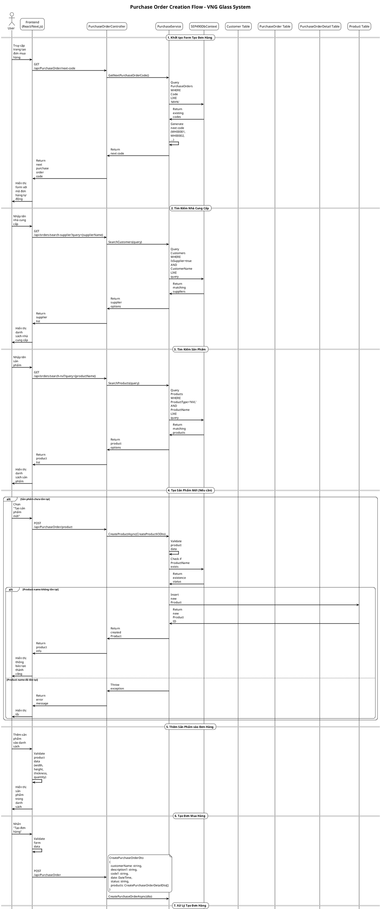

# Purchase Order Creation - Sequence Diagram

## Tổng quan về Purchase Order Module

Purchase Order Module là một module quản lý đơn hàng mua hàng trong hệ thống VNG Glass, cho phép tạo, quản lý và theo dõi các đơn hàng mua nguyên vật liệu từ nhà cung cấp.

### Cấu trúc Module:
- **Controller**: `PurchaseOrderController.cs` - Xử lý các HTTP requests
- **Service**: `PurchaseService.cs` - Logic nghiệp vụ
- **DTOs**: Các Data Transfer Objects để truyền dữ liệu
- **Models**: `PurchaseOrder.cs`, `PurchaseOrderDetail.cs` - Entity models

## Sequence Diagram - Tạo Đơn Mua Hàng



## Chi Tiết Các Bước Trong Quy Trình

### 1. **Khởi tạo Form**
- Hệ thống tự động tạo mã đơn hàng theo format `MH00001`, `MH00002`, ...
- Form được khởi tạo với các trường bắt buộc

### 2. **Tìm kiếm Nhà cung cấp**
- Hỗ trợ tìm kiếm theo tên nhà cung cấp
- Chỉ hiển thị các customer có `IsSupplier = true`
- Tự động tạo nhà cung cấp mới nếu chưa tồn tại

### 3. **Quản lý Sản phẩm**
- Tìm kiếm sản phẩm có sẵn trong hệ thống
- Tạo sản phẩm mới nếu cần thiết
- Validate thông tin sản phẩm (kích thước, số lượng)

### 4. **Tạo Đơn hàng**
- Validate toàn bộ dữ liệu đầu vào
- Tạo PurchaseOrder với status mặc định là "Pending"
- Tạo các PurchaseOrderDetail cho từng sản phẩm

### 5. **Lưu trữ Dữ liệu**
- Sử dụng Entity Framework Core
- Transaction để đảm bảo tính toàn vẹn dữ liệu
- Rollback nếu có lỗi xảy ra

## Các Trạng Thái Đơn Hàng

```csharp
public enum PurchaseStatus
{
    Pending,    // Chờ xử lý
    Ordered,    // Đã đặt hàng
    Imported,   // Đã nhập kho
    Cancelled   // Đã hủy
}
```

## Cấu Trúc Dữ Liệu

### PurchaseOrder
```csharp
public class PurchaseOrder
{
    public int Id { get; set; }
    public DateTime? Date { get; set; }
    public string? Code { get; set; }
    public int? SupplierId { get; set; }
    public string? Description { get; set; }
    public decimal? TotalValue { get; set; }
    public PurchaseStatus? Status { get; set; }
    public int? EmployeeId { get; set; }
    public int? CustomerId { get; set; }
    public ICollection<PurchaseOrderDetail>? PurchaseOrderDetails { get; set; }
}
```

### PurchaseOrderDetail
```csharp
public class PurchaseOrderDetail
{
    public int Id { get; set; }
    public int PurchaseOrderId { get; set; }
    public string? ProductName { get; set; }
    public string? Unit { get; set; }
    public int? Quantity { get; set; }
    public decimal? UnitPrice { get; set; }
    public decimal? TotalPrice { get; set; }
    public int? ProductId { get; set; }
}
```

## API Endpoints

| Method | Endpoint | Description |
|--------|----------|-------------|
| GET | `/api/PurchaseOrder/next-code` | Lấy mã đơn hàng tiếp theo |
| GET | `/api/orders/search-supplier` | Tìm kiếm nhà cung cấp |
| GET | `/api/orders/search-nvl` | Tìm kiếm sản phẩm NVL |
| POST | `/api/PurchaseOrder/product` | Tạo sản phẩm mới |
| POST | `/api/PurchaseOrder` | Tạo đơn mua hàng |
| PUT | `/api/PurchaseOrder/{id}/status` | Cập nhật trạng thái |
| POST | `/api/PurchaseOrder/{id}/import` | Nhập hàng |

## Xử Lý Lỗi

- **Validation**: Kiểm tra dữ liệu đầu vào
- **Transaction**: Đảm bảo tính toàn vẹn dữ liệu
- **Exception Handling**: Xử lý lỗi và rollback
- **Logging**: Ghi log các hoạt động quan trọng

## Bảo Mật

- **Authentication**: Yêu cầu đăng nhập
- **Authorization**: Kiểm tra quyền truy cập
- **Input Validation**: Validate dữ liệu đầu vào
- **SQL Injection Protection**: Sử dụng Entity Framework
