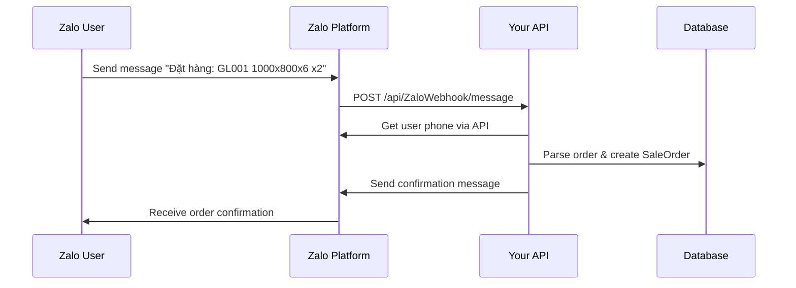

# Zalo Order API Documentation

## 📖 Mô tả
API để tạo đơn hàng từ Zalo chat bot, tự động tìm khách hàng, tạo sản phẩm và xử lý đơn hàng.

## 🌐 API Endpoints

### 1. Tạo đơn hàng từ Zalo
**POST** `/api/ZaloOrder/create`

#### Request Body:
```json
{
  "phoneNumber": "0123456789",
  "items": [
    {
      "productCode": "GL001",
      "height": "1000",
      "width": "800", 
      "thickness": 6.0,
      "quantity": 2
    },
    {
      "productCode": "GL002",
      "height": "1200",
      "width": "900",
      "thickness": 8.0,
      "quantity": 1
    }
  ]
}
```

#### Response Success (200):
```json
{
  "success": true,
  "message": "Tạo đơn hàng thành công",
  "orderDetails": {
    "orderId": 123,
    "orderCode": "ZL20240315001",
    "customerName": "Nguyễn Văn A",
    "customerPhone": "0123456789",
    "customerAddress": "123 Đường ABC, Quận 1, TP.HCM",
    "orderDate": "2024-03-15T10:30:00Z",
    "totalAmount": 1500000,
    "items": [
      {
        "productName": "Kính cường lực - 1000x800x6.0",
        "productCode": "GL001",
        "dimensions": "1000 x 800 x 6.0",
        "quantity": 2,
        "unitPrice": 500000,
        "totalPrice": 1000000
      }
    ]
  }
}
```

#### Response Error (400):
```json
{
  "success": false,
  "message": "Không tìm thấy khách hàng với số điện thoại: 0123456789",
  "orderDetails": null
}
```

### 2. Lấy thông tin đơn hàng
**GET** `/api/ZaloOrder/{orderId}`

#### Response:
```json
{
  "orderId": 123,
  "orderCode": "ZL20240315001",
  "customerName": "Nguyễn Văn A",
  "customerPhone": "0123456789",
  "customerAddress": "123 Đường ABC, Quận 1, TP.HCM",
  "orderDate": "2024-03-15T10:30:00Z",
  "totalAmount": 1500000,
  "items": [...]
}
```

### 3. Dữ liệu mẫu để test
**GET** `/api/ZaloOrder/sample`

### 4. Zalo Webhook Endpoint
**POST** `/api/ZaloWebhook/message`

Endpoint này sẽ được Zalo gọi khi có tin nhắn từ user.

## 🔧 Logic xử lý

### 1. Tìm khách hàng
- Tìm trong bảng `Customer` theo trường `Phone`
- Nếu không tìm thấy → trả về lỗi

### 2. Xử lý sản phẩm
- Từ `ProductCode` → tìm `GlassStructure`
- Từ `GlassStructureId` + kích thước → tìm `Product`
- Nếu không tìm thấy Product → tạo mới với:
  - ProductCode: `{originalCode}_{Height}x{Width}x{Thickness}`
  - ProductName: `{GlassStructure.ProductName} - {dimensions}`
  - UnitPrice: từ `GlassStructure.UnitPrice`

### 3. Tạo đơn hàng
- Tạo `SaleOrder` với OrderCode format: `ZL{yyyyMMdd}{001}`
- Tạo `OrderDetail`
- Tạo `OrderDetailProduct` cho từng item

## ✅ Validation

### PhoneNumber
- Không được để trống
- Phải tồn tại trong hệ thống

### Items
- Danh sách không được rỗng
- ProductCode không được để trống
- Height, Width không được để trống
- Thickness, Quantity phải > 0

## 🚨 Error Handling
- Customer not found
- GlassStructure not found
- Product creation failed
- Database errors

## 📊 Status Codes
- 200: Success
- 400: Validation error
- 404: Not found
- 500: Server error

## 🤖 Zalo Bot Integration & Setup

### Bước 1: Đăng ký Zalo Official Account
1. Truy cập [https://developers.zalo.me](https://developers.zalo.me)
2. Tạo ứng dụng Official Account
3. Lấy `App ID`, `App Secret`, `Access Token`

### Bước 2: Cấu hình Webhook URL
1. Trong Zalo Developer Console, cấu hình:
   - Webhook URL: `https://yourdomain.com/api/ZaloWebhook/message`
   - Events: `user_send_text`

### Bước 3: Cập nhật appsettings.json
```json
{
  "Zalo": {
    "AppId": "YOUR_APP_ID",
    "AppSecret": "YOUR_APP_SECRET", 
    "AccessToken": "YOUR_ACCESS_TOKEN",
    "OAId": "YOUR_OA_ID"
  }
}
```

### Bước 4: Quyền truy cập Phone Number
Đảm bảo Zalo OA có quyền lấy số điện thoại của user:
1. Trong Zalo Developer Console, enable quyền `user.info`
2. User cần share phone number với OA (thông qua Zalo's consent flow)
3. Phone sẽ được lấy từ Zalo API response

### Bước 5: Format tin nhắn cho user
User gửi tin nhắn theo format:
```
Đặt hàng: GL001 1000x800x6 x2, GL002 1200x900x8 x1
```

### Bước 6: Test Workflow
1. User gửi tin nhắn → Zalo gọi webhook
2. System parse tin nhắn → extract order info
3. Call ZaloOrderService → tạo đơn hàng
4. Gửi confirmation message về user

## 📁 File Structure

```
SEP490/Modules/
├── SaleOrders/
│   ├── Controllers/ZaloOrderController.cs
│   ├── Services/
│   │   ├── IZaloOrderService.cs
│   │   └── ZaloOrderService.cs
│   └── DTO/ZaloOrderDto.cs
└── Zalo/
    ├── Controllers/ZaloWebhookController.cs
    └── Services/
        ├── IZaloMessageService.cs
        └── ZaloMessageService.cs
```

## 🚀 Setup & Testing

### 1. Service Registration
Services đã được register trong `Program.cs`:
```csharp
builder.Services.AddScoped<IZaloOrderService, ZaloOrderService>();
builder.Services.AddHttpClient<IZaloMessageService, ZaloMessageService>();
```

### 2. Test với Postman
1. GET `/api/ZaloOrder/sample` - Lấy dữ liệu mẫu
2. POST `/api/ZaloOrder/create` - Test tạo đơn hàng
3. POST `/api/ZaloWebhook/message` - Test webhook

### 3. Test webhook payload:
```json
{
  "app_id": "your_app_id",
  "sender": {
    "id": "test_user_id"
  },
  "recipient": {
    "id": "your_oa_id"
  },
  "event": "user_send_text",
  "message": {
    "text": "Đặt hàng: GL001 1000x800x6 x2",
    "msg_id": "msg_123"
  },
  "timestamp": 1640995200000
}
```

### 4. Database Requirements
- Bảng `Customer` với Phone number
- Bảng `GlassStructure` với ProductCode  
- Các bảng khác sẽ tự động tạo

## 🔄 Complete Workflow



## 📱 User Experience
1. **User sends**: "Đặt hàng: GL001 1000x800x6 x2"
2. **Bot replies**: 
   ```
   ✅ ĐƠN HÀNG ĐÃ TẠO THÀNH CÔNG
   
   📋 Mã đơn hàng: ZL20240315001
   👤 Khách hàng: Nguyễn Văn A
   📍 Địa chỉ: 123 Đường ABC
   📅 Ngày đặt: 15/03/2024 10:30
   
   📦 SẢN PHẨM:
   • Kính cường lực - 1000x800x6.0
     📏 Kích thước: 1000 x 800 x 6.0
     📦 Số lượng: 2
     💰 Đơn giá: 500,000 VNĐ
     💵 Thành tiền: 1,000,000 VNĐ
   
   💰 TỔNG TIỀN: 1,000,000 VNĐ
   
   📞 Chúng tôi sẽ liên hệ với bạn sớm!
   ```

## 🛠️ Troubleshooting

### Common Issues:
1. **Webhook not receiving**: Check URL và events configuration
2. **Phone number not available**: User chưa share phone với OA hoặc OA chưa có quyền `user.info`
3. **Order creation fails**: Check Customer/GlassStructure data
4. **Message not sent**: Verify Access Token và OA permissions

### Debug Tools:
- Check logs trong ILogger
- Monitor webhook calls
- Test API endpoints directly
- Verify database records 