# Sales Order Creation - Sequence Diagram

## Tổng quan về Sales Order Module

Sales Order Module là một module quản lý đơn bán hàng trong hệ thống VNG Glass, cho phép tạo, quản lý và theo dõi các đơn hàng bán sản phẩm kính cho khách hàng.

### Cấu trúc Module:
- **Controller**: `OrderController.cs` - Xử lý các HTTP requests
- **Service**: `OrderService.cs` - Logic nghiệp vụ
- **DTOs**: Các Data Transfer Objects để truyền dữ liệu
- **Models**: `SaleOrder.cs`, `OrderDetail.cs`, `OrderDetailProduct.cs` - Entity models

## Sequence Diagram - Tạo Đơn Bán Hàng

```plantuml
@startuml SalesOrderCreation
!theme plain
skinparam backgroundColor #FFFFFF
skinparam sequenceArrowThickness 2
skinparam roundcorner 20
skinparam maxmessagesize 60

title **Sales Order Creation Flow - VNG Glass System**

actor "User" as U
participant "Frontend\n(React/Next.js)" as FE
participant "OrderController" as OC
participant "OrderService" as OS
participant "SEP490DbContext" as DB
participant "Customer Table" as CT
participant "SaleOrder Table" as SOT
participant "OrderDetail Table" as ODT
participant "OrderDetailProduct Table" as ODPT
participant "Product Table" as PT
participant "GlassStructure Table" as GST
participant "SignalR Hub" as SH

== **1. Khởi tạo Form Tạo Đơn Hàng** ==

U -> FE: Truy cập trang tạo đơn bán hàng
FE -> OC: GET /api/orders/next-order-code
OC -> OS: GetNextOrderCode()
OS -> DB: Query SaleOrders WHERE OrderCode LIKE 'ĐH%'
DB -> OS: Return existing codes
OS -> OS: Generate next code (ĐH00001, ĐH00002, ...)
OS -> OC: Return next code
OC -> FE: Return { nextOrderCode: "ĐH00001" }
FE -> U: Hiển thị form với mã đơn hàng tự động

== **2. Tải Danh Sách Cấu Trúc Kính** ==

FE -> OC: GET /api/orders/glass-structures
OC -> OS: GetAllGlassStructures()
OS -> GST: Query GlassStructures
GST -> OS: Return glass structures
OS -> OC: Return glass structures list
OC -> FE: Return glass structures
FE -> U: Hiển thị dropdown cấu trúc kính

== **3. Tìm Kiếm Khách Hàng** ==

U -> FE: Nhập tên khách hàng
FE -> OC: GET /api/orders/search-customer?query={customerName}
OC -> OS: SearchCustomers(query)
OS -> CT: Query Customers WHERE IsSupplier=false AND (CustomerCode LIKE query OR CustomerName LIKE query)
CT -> OS: Return matching customers
OS -> OC: Return customer options
OC -> FE: Return customer list
FE -> U: Hiển thị danh sách khách hàng

== **4. Tìm Kiếm Sản Phẩm** ==

U -> FE: Nhập tên sản phẩm
FE -> OC: GET /api/orders/search?query={productName}
OC -> DB: Query Products WHERE ProductType='Thành phẩm' AND (ProductCode LIKE query OR ProductName LIKE query)
DB -> OC: Return matching products
OC -> FE: Return product list
FE -> U: Hiển thị danh sách sản phẩm

== **5. Tạo Sản Phẩm Mới (Nếu cần)** ==

alt Sản phẩm chưa tồn tại
    U -> FE: Chọn "Tạo sản phẩm mới"
    FE -> OC: POST /api/orders/product
    note right: CreateProductV2Dto\n{\n  productName: string,\n  height: string,\n  width: string,\n  thickness: number,\n  glassStructureId: number,\n  productType: "Thành phẩm",\n  uom: "Tấm"\n}
    
    OC -> OS: CreateProductAsync(CreateProductV2Dto)
    OS -> OS: Validate product data
    OS -> PT: Check if ProductName exists
    PT -> OS: Return existence status
    
    alt Product name không tồn tại
        OS -> GST: Query GlassStructure WHERE Id=glassStructureId
        GST -> OS: Return glass structure
        OS -> OS: Calculate unit price (area * glassStructure.UnitPrice)
        OS -> PT: Insert new Product
        PT -> OS: Return new Product ID
        OS -> OC: Return created Product
        OC -> FE: Return product info
        FE -> U: Hiển thị thông báo tạo thành công
    else Product name đã tồn tại
        OS -> OC: Throw exception
        OC -> FE: Return error message
        FE -> U: Hiển thị lỗi
    end
end

== **6. Thêm Sản Phẩm vào Đơn Hàng** ==

U -> FE: Thêm sản phẩm vào danh sách
FE -> FE: Validate product data (width, height, thickness, quantity, unitPrice)
FE -> U: Hiển thị sản phẩm trong danh sách

== **7. Tạo Đơn Bán Hàng** ==

U -> FE: Nhấn "Tạo đơn hàng"
FE -> FE: Validate form data
FE -> OC: POST /api/orders
note right: CreateOrderDto\n{\n  customerName: string,\n  address: string,\n  phone: string,\n  orderCode: string,\n  orderDate: DateTime,\n  discount: number,\n  status: string,\n  products: CreateProductDto[]\n}

OC -> OS: CreateOrderAsync(dto)

== **8. Xử Lý Tạo Đơn Hàng** ==

OS -> CT: Query Customer WHERE CustomerName=dto.CustomerName AND Phone=dto.Phone
CT -> OS: Return existing customer or null

alt Customer không tồn tại
    OS -> CT: Insert new Customer
    note right: Customer\n{\n  CustomerName: dto.CustomerName,\n  Address: dto.Address,\n  Phone: dto.Phone,\n  Discount: dto.Discount,\n  IsSupplier: false\n}
    CT -> OS: Return new Customer ID
end

OS -> SOT: Insert new SaleOrder
note right: SaleOrder\n{\n  CustomerId: customer.Id,\n  OrderCode: dto.OrderCode,\n  OrderDate: dto.OrderDate,\n  Status: Status.Pending\n}
SOT -> OS: Return SaleOrder ID

OS -> ODT: Insert new OrderDetail
note right: OrderDetail\n{\n  SaleOrderId: order.Id\n}
ODT -> OS: Return OrderDetail ID

== **9. Tạo Chi Tiết Sản Phẩm** ==

loop For each product in dto.Products
    OS -> ODPT: Insert OrderDetailProduct
    note right: OrderDetailProduct\n{\n  OrderDetailId: detail.Id,\n  ProductId: p.ProductId,\n  Quantity: p.Quantity,\n  TotalAmount: p.Quantity * p.UnitPrice\n}
    ODPT -> OS: Return Detail Product ID
end

OS -> DB: SaveChanges()
DB -> OS: Confirm transaction

== **10. Gửi Thông Báo Real-time** ==

OS -> SH: SendAsync("SaleOrderCreated", message)
SH -> FE: Broadcast to all clients
FE -> U: Hiển thị thông báo real-time

OS -> OC: Return SaleOrder ID
OC -> FE: Return { message: "Tạo đơn hàng thành công.", id: orderId }
FE -> U: Hiển thị thông báo tạo thành công

== **11. Chuyển Hướng** ==

FE -> FE: Redirect to sales order list
FE -> U: Hiển thị danh sách đơn bán hàng

@enduml
```



## Chi Tiết Các Bước Trong Quy Trình

### 1. **Khởi tạo Form**
- Hệ thống tự động tạo mã đơn hàng theo format `ĐH00001`, `ĐH00002`, ...
- Tải danh sách cấu trúc kính để tạo sản phẩm mới
- Form được khởi tạo với các trường bắt buộc

### 2. **Tìm kiếm Khách hàng**
- Hỗ trợ tìm kiếm theo mã khách hàng hoặc tên khách hàng
- Chỉ hiển thị các customer có `IsSupplier = false`
- Tự động tạo khách hàng mới nếu chưa tồn tại

### 3. **Quản lý Sản phẩm**
- Tìm kiếm sản phẩm có sẵn trong hệ thống (ProductType = "Thành phẩm")
- Tạo sản phẩm mới với cấu trúc kính nếu cần thiết
- Tính toán đơn giá dựa trên diện tích và đơn giá cấu trúc kính
- Validate thông tin sản phẩm (kích thước, số lượng, đơn giá)

### 4. **Tạo Đơn hàng**
- Validate toàn bộ dữ liệu đầu vào
- Tạo SaleOrder với status mặc định là "Pending"
- Tạo OrderDetail và OrderDetailProduct cho từng sản phẩm
- Tính toán tổng tiền và áp dụng chiết khấu

### 5. **Real-time Notification**
- Sử dụng SignalR để gửi thông báo real-time
- Thông báo cho tất cả client khi có đơn hàng mới
- Hiển thị thông tin người tạo và mã đơn hàng

## Các Trạng Thái Đơn Hàng

```csharp
public enum Status
{
    Pending,     // Chờ xử lý
    Processing,  // Đang xử lý
    Delivered,   // Đã giao hàng
    Cancelled    // Đã hủy
}

public enum DeliveryStatus
{
    NotDelivered,    // Chưa giao hàng
    Delivering,      // Đang giao hàng
    FullyDelivered,  // Đã giao hàng hoàn toàn
    Cancelled        // Đã hủy
}
```

## Cấu Trúc Dữ Liệu

### SaleOrder
```csharp
public class SaleOrder
{
    public int Id { get; set; }
    public string? OrderCode { get; set; }
    public DateTime OrderDate { get; set; }
    public int CustomerId { get; set; }
    public decimal? OrderValue { get; set; }
    public Status Status { get; set; }
    public DeliveryStatus DeliveryStatus { get; set; }
    public bool IsUpdateMisa { get; set; }
    public string? Note { get; set; }
    public Customer Customer { get; set; }
    public ICollection<OrderDetail> OrderDetails { get; set; }
}
```

### OrderDetail
```csharp
public class OrderDetail
{
    public int Id { get; set; }
    public string? OrderCode { get; set; }
    public int SaleOrderId { get; set; }
    public decimal? TotalAmount { get; set; }
    public SaleOrder SaleOrder { get; set; }
    public ICollection<OrderDetailProduct> OrderDetailProducts { get; set; }
}
```

### OrderDetailProduct
```csharp
public class OrderDetailProduct
{
    public int OrderDetailId { get; set; }
    public int ProductId { get; set; }
    public int? Quantity { get; set; }
    public decimal? TotalAmount { get; set; }
    public OrderDetail OrderDetail { get; set; }
    public Product Product { get; set; }
}
```

## API Endpoints

| Method | Endpoint | Description |
|--------|----------|-------------|
| GET | `/api/orders/next-order-code` | Lấy mã đơn hàng tiếp theo |
| GET | `/api/orders/glass-structures` | Lấy danh sách cấu trúc kính |
| GET | `/api/orders/search-customer` | Tìm kiếm khách hàng |
| GET | `/api/orders/search` | Tìm kiếm sản phẩm thành phẩm |
| POST | `/api/orders/product` | Tạo sản phẩm mới |
| POST | `/api/orders` | Tạo đơn bán hàng |
| PUT | `/api/orders/{id}/status` | Cập nhật trạng thái |
| GET | `/api/orders/{id}` | Lấy chi tiết đơn hàng |

## Tính Năng Đặc Biệt

### 1. **Tính Toán Đơn Giá Tự Động**
- Dựa trên diện tích sản phẩm (Width × Height)
- Áp dụng đơn giá từ cấu trúc kính
- Công thức: `UnitPrice = (Width × Height / 1,000,000) × GlassStructure.UnitPrice`

### 2. **Real-time Notifications**
- Sử dụng SignalR Hub
- Thông báo ngay lập tức khi có đơn hàng mới
- Hiển thị thông tin người tạo và thời gian

### 3. **Quản Lý Chiết Khấu**
- Chiết khấu theo khách hàng
- Tính toán tổng tiền sau chiết khấu
- Lưu trữ thông tin chiết khấu trong Customer

### 4. **Validation Nâng Cao**
- Kiểm tra trùng lặp tên sản phẩm
- Validate kích thước và số lượng
- Kiểm tra tồn tại cấu trúc kính

## Xử Lý Lỗi

- **Validation**: Kiểm tra dữ liệu đầu vào
- **Transaction**: Đảm bảo tính toàn vẹn dữ liệu
- **Exception Handling**: Xử lý lỗi và rollback
- **Logging**: Ghi log các hoạt động quan trọng

## Bảo Mật

- **Authentication**: Yêu cầu đăng nhập
- **Authorization**: Kiểm tra quyền truy cập (MANAGER, ACCOUNTANT)
- **Input Validation**: Validate dữ liệu đầu vào
- **SQL Injection Protection**: Sử dụng Entity Framework
