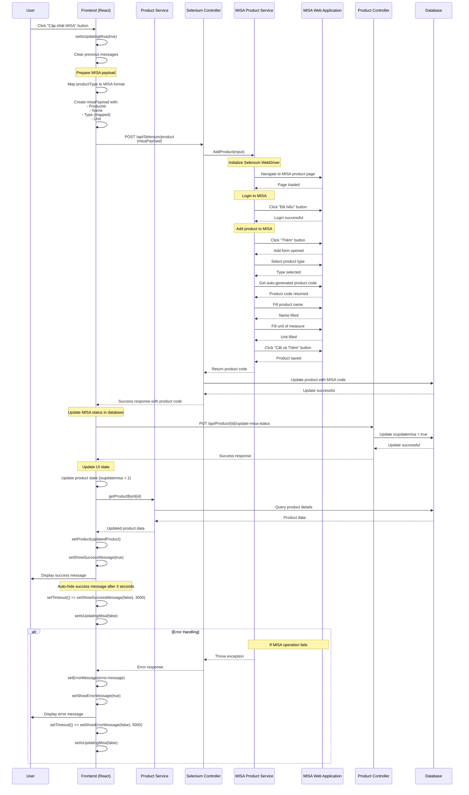

# Sequence Diagram - Update MISA Product

## Mô tả
Sequence diagram này mô tả luồng hoạt động của chức năng cập nhật sản phẩm lên hệ thống MISA.

## Sequence Diagram



## Các thành phần chính

### 1. Frontend (React)
- **File**: `fe/app/(defaults)/products/[id]/page.tsx`
- **Function**: `handleUpdateMisa()`
- **Service**: `fe/app/(defaults)/products/[id]/service.ts`

### 2. Backend Controllers
- **SeleniumController**: `/api/Selenium/product` (POST)
- **ProductController**: `/api/Product/{id}/update-misa-status` (PUT)

### 3. Services
- **MisaProductService**: Xử lý automation với MISA web app
- **ProductService**: Quản lý dữ liệu sản phẩm

### 4. External System
- **MISA Web Application**: Hệ thống kế toán MISA

## Luồng xử lý chính

1. **User Action**: User click button "Cập nhật MISA"
2. **UI Preparation**: Frontend chuẩn bị payload và set loading state
3. **MISA Integration**: Gọi Selenium service để automation với MISA
4. **Database Update**: Cập nhật trạng thái `isupdatemisa` trong database
5. **UI Refresh**: Cập nhật UI với dữ liệu mới và hiển thị thông báo
6. **Error Handling**: Xử lý lỗi nếu có sự cố xảy ra

## Mapping Product Type

```typescript
const mapProductTypeToMisa = (productType: string): string => {
    switch (productType.toLowerCase()) {
        case 'nvl':
        case 'nguyên vật liệu':
            return "Nguyên vật liệu";
        case 'thành phẩm':
        case 'tp':
            return "Thành phẩm";
        default:
            return "Hàng hóa";
    }
};
```

## Error Handling

- **MISA Operation Failure**: Hiển thị error message trong 5 giây
- **Database Update Failure**: Hiển thị error message
- **Network Issues**: Timeout và retry logic
- **Validation Errors**: Kiểm tra dữ liệu trước khi gửi

